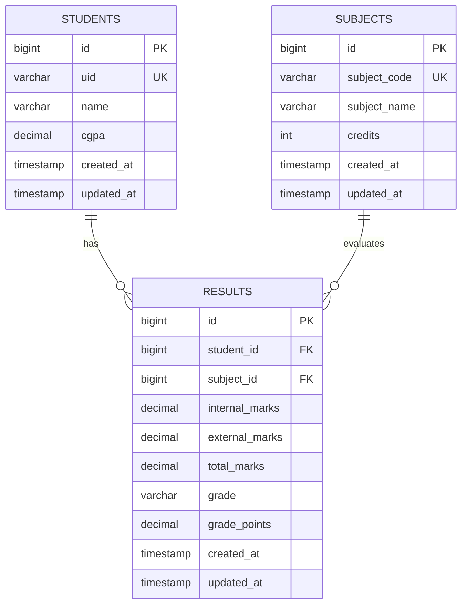
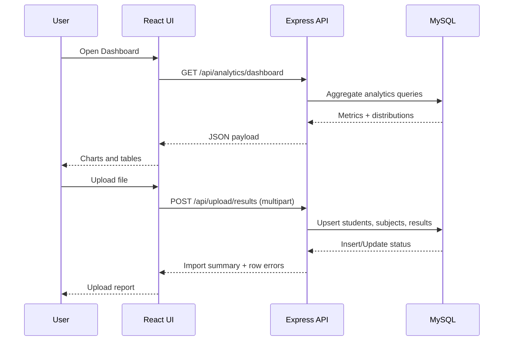

# Student Result Analysis System - Research Report

## 1. Report Metadata

- Project Title: Student Result Analysis System
- Repository: student-result-analysis-2.0
- Branch Analyzed: main
- Report Date: 2026-03-28
- Domain: Educational Data Analytics
- Stack: React + Node.js + Express + MySQL

---

## 2. Abstract

The Student Result Analysis System is a full-stack web platform designed to centralize student academic records, automate result ingestion, and generate actionable analytics for educators and administrators. The system supports structured CRUD operations for students and subjects, bulk import of results from CSV/Excel files, dashboard-level statistical insights, student-wise trend analysis, and report export in CSV and PDF formats.

The architecture follows a clear separation of concerns: frontend presentation and data visualization (React + Recharts), RESTful API and business logic (Express + service layer), and a relational persistence model (MySQL with constraints and indexed joins). This report documents the system design, implemented modules, database model, analytical methods, performance considerations, and future research extensions.

---

## 3. Problem Statement

Educational institutions often manage results in fragmented spreadsheets or static files, making it difficult to:

- detect at-risk students early,
- compare subject-level outcomes,
- maintain consistent data quality,
- generate shareable reports quickly,
- and derive trends for evidence-based academic interventions.

This project addresses these issues through a unified result management and analytics platform.

---

## 4. Objectives

1. Build a centralized and validated academic result repository.
2. Provide easy bulk ingestion of marks data from common file formats.
3. Compute dashboard analytics (distribution, pass rates, top performers, volatility).
4. Support student profile drill-down with trend visualizations.
5. Export student reports in machine-readable and human-readable formats.
6. Maintain modular, maintainable backend and frontend architecture.

---

## 5. Technology Stack

### 5.1 Backend

- Runtime: Node.js (ES modules)
- Framework: Express
- Database driver: mysql2/promise
- Validation: Zod
- Uploads: Multer
- File parsing: csv-parse, ExcelJS
- Report generation: csv-stringify, PDFKit
- Security/logging: helmet, cors, morgan

### 5.2 Frontend

- Framework: React (Vite)
- Routing: react-router-dom
- API client: Axios
- Visualization: Recharts
- Styling: Tailwind CSS

### 5.3 Data/Utility Tooling

- SQL schema bootstrap: backend/sql/init.sql
- Test and seed datasets: backend/test-data
- Optional PDF to CSV preprocessing utility: backend/tools/pdf_to_csv.py

---

## 6. System Architecture

### Figure 1: High-Level Architecture Diagram

```mermaid
flowchart LR
    U[User: Faculty/Admin] --> FE[React Frontend]
    FE -->|REST API Calls| BE[Express Backend]
    FE -->|Charts & Tables| VIZ[Recharts Visualization]

    BE --> RT[Route Layer]
    RT --> CT[Controller Layer]
    CT --> SV[Service Layer]
    SV --> DB[(MySQL Database)]

    FE -->|Upload CSV/XLS/XLSX| UP[/upload/results]
    UP --> BE

    BE -->|CSV Report| RCSV[/reports/students/:id/csv]
    BE -->|PDF Report| RPDF[/reports/students/:id/pdf]

    DB --> AN[Analytics Queries]
    AN --> BE
    BE --> FE
```

### Architectural Notes

- The backend is organized by route -> controller -> service layers.
- Validation and business logic are mostly in service modules.
- The database schema enforces integrity with unique keys and foreign keys.
- The frontend consumes typed API functions and renders analytics dashboards and profile-level charts.

---

## 7. Database Design

The schema defines three core tables and one analytical view:

- students
- subjects
- results
- performance_summary (view)

### Figure 2: ER Diagram



### Constraint Design Highlights

- `students.uid` is unique.
- `subjects.subject_code` is unique.
- `results(student_id, subject_id)` is unique to avoid duplicate subject entries for a student.
- `results.student_id` and `results.subject_id` use foreign keys with cascade delete.
- Check constraints ensure valid ranges for CGPA and grade points.

---

## 8. Backend Module Design

### 8.1 Core API Modules

- Students module
  - List, create, read-by-id, update, delete student records.
- Subjects module
  - List, create, update, delete subject records.
- Results module
  - List with filters, create, delete, and upsert (internally used by bulk upload).
- Analytics module
  - Dashboard statistics and per-student performance trend.
- Reports module
  - Student-wise CSV and PDF report generation.
- Upload module
  - Bulk ingest results from CSV/Excel with per-row validation summary.

### 8.2 Error Handling Strategy

- Async route wrapping via async middleware.
- Structured HTTP errors for service-level business failures.
- Zod validation errors mapped to HTTP 400 responses.
- Centralized `notFound` and `errorHandler` middleware.

### 8.3 Data Access Pattern

- Unified query helper around MySQL pool.
- Services execute SQL and return normalized response data.
- Controllers remain thin and focus on HTTP semantics.

---

## 9. Frontend Module Design

### 9.1 Navigation Structure

- Dashboard
- Students
- Student Profile
- Subjects
- Bulk Upload

### 9.2 UI Components

- `Layout`: sidebar and app shell.
- `DataTable`: reusable tabular rendering with custom cell renderers.
- `ChartCard`: chart container with consistent visual style.
- `StatCard`: key metric display.

### 9.3 Data Integration

- Axios client with configurable `VITE_API_URL`.
- API utility modules segmented by domain (`studentApi`, `subjectApi`, etc.).
- Async handling patterns with loading and error states.

### Figure 3: User Interaction and Data Flow



---

## 10. Analytics and Computation Methods

The analytics service computes multi-level statistics used by the dashboard:

- global summary averages,
- at-risk student identification,
- per-subject toppers,
- grade distribution,
- pass rate by subject,
- subject-level spread and volatility,
- top student ranking by weighted grade points,
- score bell-curve buckets.

### 10.1 Weighted Grade Points

For each student:

$$
\text{WeightedGradePoints} = \frac{\sum_{i=1}^{n}(GP_i \cdot C_i)}{\sum_{i=1}^{n} C_i}
$$

where $GP_i$ is grade points in subject $i$ and $C_i$ is subject credits.

### 10.2 Pass Rate per Subject

$$
\text{PassRate}(\%) = \frac{\text{count}(GP \ge 6)}{\text{total attempts}} \times 100
$$

### 10.3 At-Risk Heuristic

A student is marked at-risk if:

- average grade points < 6, OR
- number of low-grade subjects (grade points < 5) >= 2.

This creates an intervention-focused cohort for academic support.

---

## 11. Bulk Upload Pipeline

### Accepted File Types

- CSV
- XLSX
- XLS

### Processing Stages

1. Detect file extension and parse rows.
2. Normalize headers and row values.
3. Validate required fields and value ranges.
4. Upsert student and subject records.
5. Upsert result row keyed by `(student_id, subject_id)`.
6. Return aggregate upload summary:
   - totalRows
   - imported
   - failed
   - row-wise error messages

### Data Quality Controls

- Mandatory fields check (`uid`, `name`, `subject_code`, `subject_name`, `grade`).
- Numeric checks for credits and grade points.
- Defensive handling of null/empty marks.

---

## 12. Reporting Capabilities

### 12.1 CSV Report

- Endpoint: `/api/reports/students/:studentId/csv`
- Returns flat, structured subject-wise performance rows.

### 12.2 PDF Report

- Endpoint: `/api/reports/students/:studentId/pdf`
- Includes student header and line-by-line subject performance summary.

This supports both data processing workflows (CSV) and formal sharing workflows (PDF).

---

## 13. Implemented API Surface (Summary)

### Students

- `GET /api/students`
- `GET /api/students/:id`
- `POST /api/students`
- `PUT /api/students/:id`
- `DELETE /api/students/:id`

### Subjects

- `GET /api/subjects`
- `POST /api/subjects`
- `PUT /api/subjects/:id`
- `DELETE /api/subjects/:id`

### Results

- `GET /api/results?studentId=&subjectCode=`
- `POST /api/results`
- `DELETE /api/results/:id`

### Analytics

- `GET /api/analytics/dashboard`
- `GET /api/analytics/students/:studentId/trend`

### Upload and Reports

- `POST /api/upload/results`
- `GET /api/reports/students/:studentId/csv`
- `GET /api/reports/students/:studentId/pdf`

---

## 14. Non-Functional Characteristics

### 14.1 Modularity and Maintainability

- Clearly separated route/controller/service architecture.
- Domain-based frontend API modules and reusable UI components.

### 14.2 Security Baseline

- Helmet headers.
- CORS enabled for frontend-backend integration.
- Input validation via Zod and controlled error propagation.

### 14.3 Scalability Considerations

- Query indexes on foreign keys and unique business keys.
- SQL aggregations for analytics are database-native.
- Potential future optimization via caching and precomputed views.

---

## 15. Experimental and Evaluation Plan for Research Paper

For publication-quality evaluation, the following protocol is recommended:

1. Dataset Preparation
   - Use provided seed files and additional synthetic cohorts.
   - Include balanced and skewed performance distributions.

2. Functional Validation
   - CRUD correctness across students/subjects/results.
   - Upload validation with malformed and valid files.
   - Report generation checks for empty/non-empty student histories.

3. Performance Measurement
   - Upload throughput (rows/sec).
   - Dashboard query latency under varying dataset sizes.
   - PDF/CSV generation time vs subject-count per student.

4. Analytics Correctness
   - Cross-validate SQL metrics against independent spreadsheet calculations.
   - Verify ranking and pass-rate formulas against sampled records.

5. Usability Assessment
   - Task completion study: upload, profile inspection, report export.
   - Error comprehension score from upload feedback messages.

---

## 16. Current Limitations

- Authentication/authorization is not yet implemented.
- Semester-aware schema is not fully modeled in core tables.
- Analytics are batch query based and not real-time streaming.
- No automated test suite is currently integrated in this snapshot.
- PDF layout is concise and text-first, not template-styled.

---

## 17. Future Work

1. Add role-based access control (admin/faculty/student).
2. Introduce semester, department, and batch-level data dimensions.
3. Add predictive analytics for dropout/failure risk forecasting.
4. Implement background jobs for large uploads and report generation.
5. Add full test coverage and CI pipeline.
6. Integrate export dashboards and publication-grade report templates.

---

## 18. Conclusion

The Student Result Analysis System demonstrates a practical and extensible architecture for academic performance management. Its implementation combines robust data integrity, modular full-stack design, and useful analytics outputs for institutional decision support. The project is suitable as a foundation for research work in educational data mining, performance monitoring, and intervention-driven analytics platforms.

---

## Appendix A: Reproducibility Notes

### Backend

- Initialize DB schema using `backend/sql/init.sql`.
- Configure environment variables for DB connection.
- Start backend via `npm run dev` in backend folder.

### Frontend

- Configure `VITE_API_URL` if needed.
- Start frontend via `npm run dev` in frontend folder.

### Optional Data Utility

- Use `backend/tools/pdf_to_csv.py` to convert supported PDF result formats into upload-ready CSV.

---

## Appendix B: Suggested Figures for Final Paper Submission

1. High-Level Architecture Diagram (Figure 1)
2. ER Diagram (Figure 2)
3. Interaction/Data Flow Sequence (Figure 3)
4. Dashboard Screenshot from running frontend
5. Upload Summary Screenshot for error handling demonstration
6. Student Trend Screenshot (grade points vs total marks)

These can be exported from the running app and inserted into the final manuscript as raster images (PNG) with captions.
